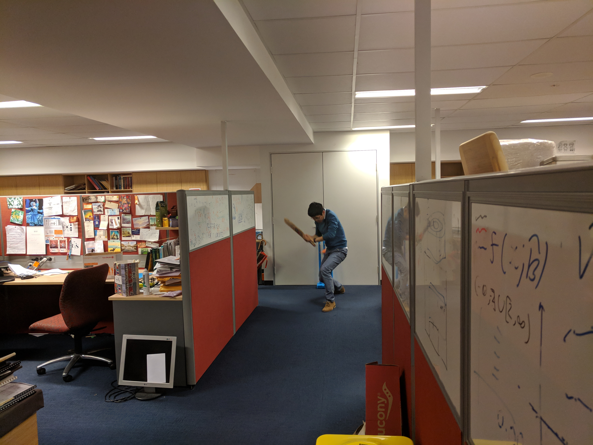
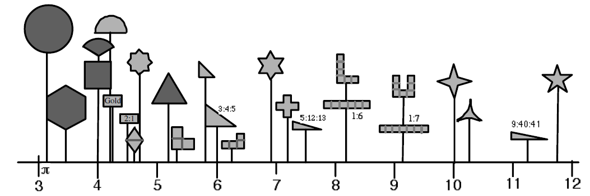
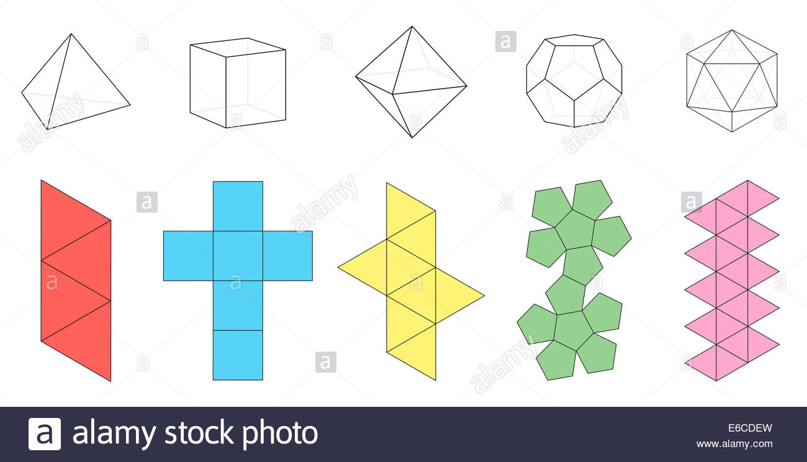
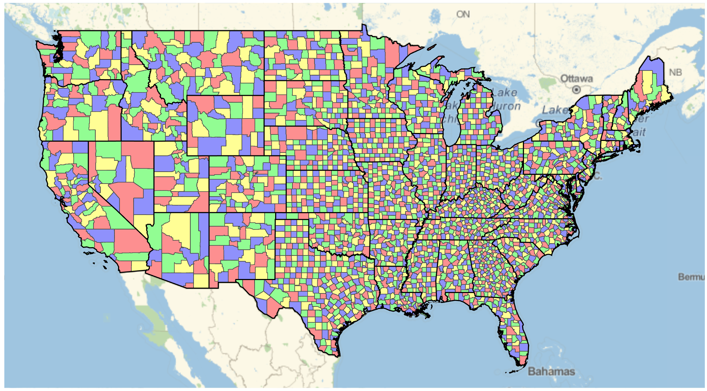
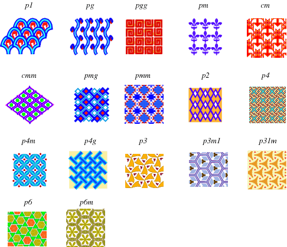
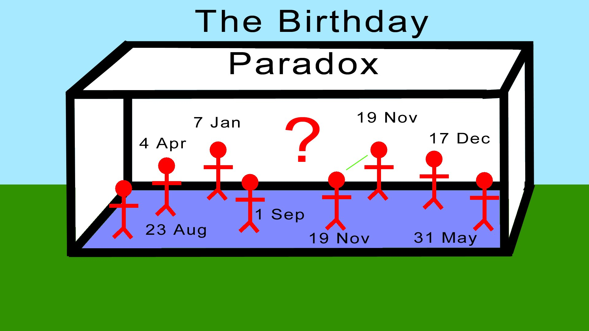

class: segue

## Brussel Sprouts game!

---

## Who am I?

+ Current PhD student in biostatistics at the University of Sydney.
+ Just came off a statistics lecture 5 minutes ago!
+ I was the President of the USYD Maths Society.
+ As you will see soon, I watch too much cricket...

---
class: segue

## Brainstorm: What sorts of jobs need maths?

How is maths used in the real world? 

---

## Maths is about numbers

+ Finance and Money: $ $ $
+ Education: That was me 5 minutes ago!
+ Business analytics: Google, and even this software Zoom!
+ Security: Remember Facebook's big scandal this year?
+ Health: My research area!

--

<blockquote>
Maths is constantly carving out new career options. 
</blockquote>

Even traditional jobs like lawyers are facing competitions from automation. 

---

## My high school maths career

+ Year 7 - 10: Maths is just a bunch of numbers
+ Yer 11 - 12: Maths is a bunch of weird numbers... I mean, what is $\sqrt{-1}$ anyway?

--
+ At the end of Year 12, I went to a seminar at the University of Sydney:

<blockquote>
Mathematics is about revealing crazy structures and patterns of the universe. 
</blockquote>

<blockquote>
It is about looking at a donut and realise that is is not a pancake!
</blockquote>

+ I signed up for a maths degree at USYD, then a Honours degree, and now a PhD.

<!-- ## The largest area you can enclose using a string is a circle -->
<!--  -->
<!-- --- -->
<!-- ## There are only *5* polyhedrons with regular polygons as faces -->
<!--  -->
<!-- --- -->
---
## You can colour any map using only *4* colours

---
## There are only *17* wallpaper patterns

<!-- ## There is a 50% chance that *2 out of 23* randomly selected people has the same birthday -->
<!--  -->
<!-- --- -->
<!-- ## You can have a solution formula for quadratic equation: $a x^2 + bx + c = 0$ -->

<!-- -- -->

<!-- + The solution is $x=\frac{-b\pm\sqrt{b^2-4ac}}{2a}$. -->

<!-- -- -->

<!-- + Also, there is a formula for a cubic, $ax^3 + bx^2 + cx + d = 0$ equation: -->
<!--  -->

<!-- --- -->

<!-- ## Even a quartic equation: $ax^4 + bx^3 + cx^2 + dx + e = 0$ -->

<!-- .scroll-output[ -->
<!--   -->
<!-- ] -->

<!-- --- -->
<!-- ## But no such solution exist for a quintic equation! -->

<!-- .content-box-blue[ -->
<!-- Think of all the formulas you can construct, **NOT A SINGLE ONE** of those equations can solve $ax^5 + bx^4 + cx^3 + dx^2 + ex +f = 0$.  -->
<!-- ] -->

<!-- --- -->

---
## So what is this mathematics thing anyway?

+ Mathematics is about **structures** and **patterns** of the Universe!
+ Mathematics is **a language** to describe these weird and wonderful things!
+ The greatest power of a mathematician is that it can take something completely innocently weird, understand what makes it weird and special, and test out if this weird property can be used to do something else, like understanding cancer! 
---
## My research

Bio-statistics: using mathematics and statistics to understand what *structures* and *patterns* lies in complex diseases: 

+ Which of the available 10 anti-cancer drugs is the best for John Citizen?

--

+ How to link melanoma to a group of proteins?
--

+ Why did Australia keep losing the Ashes to England? 

---
## Networks 

+ Brussel sprouts is a game about networks! 

--

+ The game exploited the fact that on a whiteboard, only 8 possible moves can be made, so player 2 will always win! 
--

+ But player 1 will always win on this surface. 

--

+ [A cricket network](ausEngNetwork_01_Sep_2018.html) and [a cancer network](http://shiny.maths.usyd.edu.au/PACMEN/)
---
class: segue

## Q&A